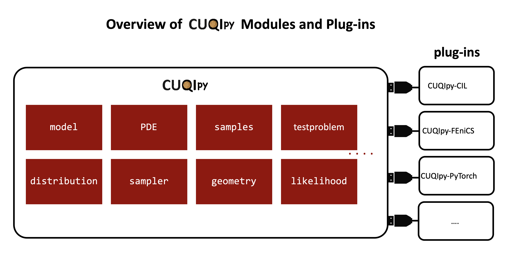

#  Overview of CUQIpy

## Table of Contents:
* [What is CUQIpy?](#what-is-cuqipy)
* [Why CUQIpy?](#why-cuqipy)
* [CUQIpy modules](#cuqipy-modules)
* [CUQIpy plugins](#cuqipy-plugins)
* [CUQIpy design principles](#cuqipy-design-principles)
  * [Bayesian Inverse Problem in 5 steps](#bayesain-inverse-problem-in-5-steps)
* [Role of CUQIpy in this course](#role-of-cuqipy-in-this-course)
* [CUQIpy component learning objectives](#cuqipy-component-learning-objectives)
* [CUQIpy installation](#installation)

## Introduction 

### What is CUQIpy? 
* CUQIpy is a Python package.
* CUQIpy stands for **C**omputational **U**ncertainty **Q**uantification for **I**nverse **P**roblems in **Py**thon.
* CUQIpy provides a framework for solving inverse problems using Bayesian inference.
* The framework enables:
  * Modeling Bayesian inverse problems
  * Solving Bayesian inverse problems using classical and advanced numerical tools
  * Analyzing the solution of Bayesian inverse problems

**placeholder for image of CUQIpy components-the three columns**

### CUQIpy modules 
* CUQIpy consists of many modules for modeling, solving, and analyzing Bayesian inverse problems.
* These modules mostly correspond to typical steps/components in a Bayesian inverse problem.
* Each module contains classes and functions that are used to perform specific tasks.
* click [here](https://cuqi-dtu.github.io/CUQIpy/api/index.html) for an overview of the modules available in CUQIpy.

### CUQIpy plugins 

* In addition to the CUQIpy modules, CUQIpy also has plugins that extend the functionality of the framework. 
* These plugins allows integration of third party software and tools with CUQIpy.
* click [here](https://cuqi-dtu.github.io/CUQIpy/#cuqipy-plugins) to see the list of plugins available in CUQIpy.

## CUQIpy installation 

https://cuqi-dtu.github.io/CUQIpy/user/getting_started.html

